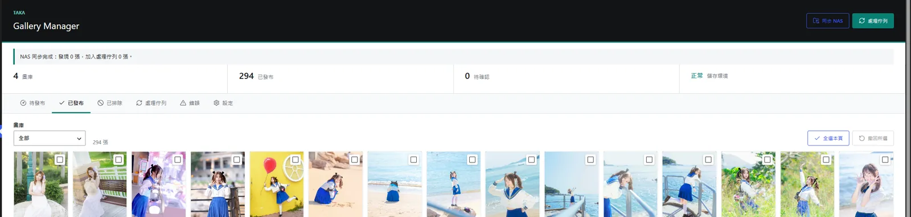

# Taka Virtual Gallery

[繁體中文](#繁體中文) | [English](#english)

Taka Virtual Gallery is a private-storage WordPress gallery with a responsive, windowed masonry frontend.


## 繁體中文

Taka Virtual Gallery 是一個以私人檔案儲存空間為來源的 WordPress 圖庫外掛。它不會把原圖註冊到 WordPress 媒體庫，而是建立索引、產生 WebP 衍生檔，並以視窗化瀑布流呈現大量圖片。

> [!NOTE]
> 本專案是 **vibecoding 產物**。在正式環境使用前，請自行審查程式碼、安全邊界及部署方式。

### v0.1.7 功能

- 增量與背景資料夾掃描，保留持久化進度並可靠處理數字檔名游標
- 圖片批次審核、指派、排除、還原、發布與撤回
- 可重試的 WebP 衍生檔處理及等比例私人縮圖生成
- 由瀏覽器工作階段綁定的短效簽名 URL 傳送私人圖片
- Apache 傳送採 fail-closed 設計，不會退回公開 X-Sendfile 路徑
- Elementor widget 與 `[taka_gallery]` shortcode
- 響應式、視窗化 masonry layout 與穩定的單頁隨機排序
- 僅限管理員查看的 DOM virtualization 統計 HUD

### Gallery Manager

後台提供圖庫狀態摘要、批次操作、背景 NAS 掃描、處理佇列、錯誤重試及儲存環境檢查。



### DOM virtualization / windowed rendering

完整 masonry layout 會保留頁面高度，但 React 只掛載 viewport 加上上下各半個 viewport 緩衝範圍內的 tile。捲動時會替換離屏節點，而不是讓 DOM 數量隨已載入圖片持續增長。

[](docs/media/virtualized-masonry-demo.mp4)

[觀看 33 秒捲動示範（MP4，約 9.7 MB）](docs/media/virtualized-masonry-demo.mp4)

畫面中的 `Loaded images: 102` 代表已取得並排版的項目；`Mounted DOM tiles: 9` 代表當下實際存在於 DOM 的圖片節點。`Window buffer: 0.5 viewport` 表示可視區域上下各保留半個 viewport 作為 overscan。這個 HUD 只會對具有 `manage_taka_galleries` 權限的管理員顯示，公開訪客不會看到。

### 系統需求與安裝

- WordPress 6.6 或以上、PHP 8.1 或以上、PHP Imagick、Apache `mod_xsendfile`
- 可供 PHP 讀取的原圖目錄，以及可供 PHP 寫入的衍生檔目錄
- 啟用外掛後，在 **Taka Gallery → 設定** 填入兩個絕對路徑
- 使用 Elementor 的 **Taka Virtual Gallery** widget 或 `[taka_gallery]` shortcode

本倉庫刻意不提供特定主機、NAS、容器或反向代理設定。請依自己的環境，以最小權限原則設定私人儲存空間及媒體傳送。

### 開發

```bash
npm install
npm test
npm run lint
npm run lint:php
npm run build
```

`assets/dist/` 是外掛執行所需的已編譯前端資源；`node_modules/`、本機快取及環境設定不會提交。

### 安全界線

外掛不會把原始路徑、原始檔名、EXIF 資料或永久媒體 URL 傳給公開瀏覽器。衍生檔 URL 綁定 HttpOnly 工作階段並具有有效期限，但這不是 DRM：任何已在瀏覽器顯示的圖片仍可透過開發者工具或螢幕截圖保存。

### 靈感與致謝

- [brunofranciscojs/react-gallery](https://github.com/brunofranciscojs/react-gallery)
- [gs25087/Virtualized-Masonry-Grid](https://github.com/gs25087/Virtualized-Masonry-Grid)

### 授權

本專案依 [GNU General Public License v2.0 or later](LICENSE) 授權。

## English

Taka Virtual Gallery is a WordPress gallery plugin backed by private file storage. Instead of registering originals in the WordPress media library, it indexes source folders, creates WebP derivatives, and renders large collections through a virtualized masonry layout.

> [!NOTE]
> This project is a **vibecoding product**. Review the code, security boundaries, and deployment design before using it in production.

### v0.1.7 features

- Incremental and background folder scanning with persistent progress and reliable numeric filename cursors
- Batch review, assignment, exclusion, restoration, publishing, and withdrawal
- Retryable WebP derivative processing with proportional private thumbnail generation
- Private images delivered through short-lived signed URLs bound to a browser session
- Fail-closed Apache delivery that never falls back to exposing X-Sendfile paths
- Elementor widget and `[taka_gallery]` shortcode
- Responsive, windowed masonry with stable per-page random ordering
- Administrator-only DOM virtualization statistics HUD

### Gallery Manager

The WordPress manager provides gallery summaries, batch actions, background NAS scans, processing queues, retries, and storage health checks.


### DOM virtualization / windowed rendering

The complete masonry layout preserves the page height, while React mounts only tiles inside the viewport plus a half-viewport overscan buffer above and below. Scrolling replaces off-screen nodes instead of continuously growing the DOM.

[](docs/media/virtualized-masonry-demo.mp4)

[Watch the 33-second scrolling demonstration (MP4, approximately 9.7 MB)](docs/media/virtualized-masonry-demo.mp4)

`Loaded images: 102` is the number of fetched and positioned items. `Mounted DOM tiles: 9` is the number of image tiles actually present in the DOM at that moment. `Window buffer: 0.5 viewport` describes the overscan on each side of the visible viewport. The HUD is shown only to administrators with the `manage_taka_galleries` capability; public visitors never receive it.

### Requirements and installation

- WordPress 6.6 or later, PHP 8.1 or later, PHP Imagick, and Apache `mod_xsendfile`
- An originals directory readable by PHP and a derivatives directory writable by PHP
- After activation, enter both absolute paths under **Taka Gallery → Settings**
- Use the **Taka Virtual Gallery** Elementor widget or `[taka_gallery]` shortcode

This repository intentionally excludes host-specific NAS, container, proxy, and server configuration. Configure private storage and media delivery for your environment using least-privilege access.

### Development

```bash
npm install
npm test
npm run lint
npm run lint:php
npm run build
```

`assets/dist/` contains the compiled frontend assets required at runtime. `node_modules/`, local caches, and environment configuration are excluded.

### Security boundary

The plugin does not expose original paths, original filenames, EXIF data, or permanent media URLs to public browsers. Derivative URLs are session-bound and expire, but this is not DRM: any image displayed in a browser can still be saved through developer tools or screenshots.

### Inspiration and acknowledgements

- [brunofranciscojs/react-gallery](https://github.com/brunofranciscojs/react-gallery)
- [gs25087/Virtualized-Masonry-Grid](https://github.com/gs25087/Virtualized-Masonry-Grid)

### License

Licensed under the [GNU General Public License v2.0 or later](LICENSE).
